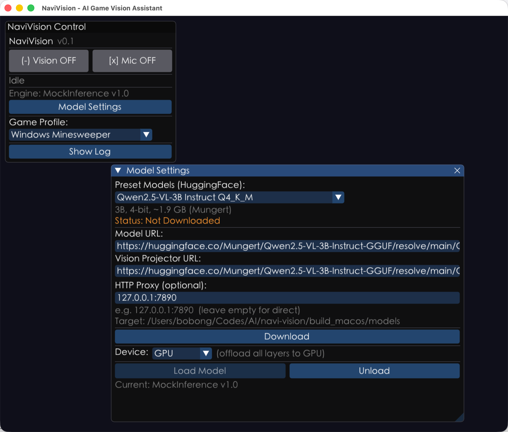

# NaviVision

**NaviVision** is a real-time game screen analysis tool powered by Vision-Language Models (VLM). It periodically captures a selected window, feeds the frame into a locally running multimodal model (Qwen2.5-VL family by default), and renders the structured JSON output — current status, detected units, tactical advice, confidence — live in an ImGui interface.

All inference runs locally via [llama.cpp](https://github.com/ggml-org/llama.cpp) + mtmd multimodal backend. No network required.

> 中文版说明见 [README-zh.md](README-zh.md)



---

## Features

- **Cross-platform window capture**
  - Windows: Windows Graphics Capture (WGC) API
  - macOS: ScreenCaptureKit / CGWindowList
- **Local VLM inference**: loads GGUF multimodal models (main weights + mmproj vision projector) through llama.cpp + mtmd
- **Profile-driven**: each game uses a standalone JSON config (system prompt, status color palette, UI labels, mock scenarios) under [profiles/](profiles/) — extensible without touching C++ code
- **ImGui live UI**: control panel, window picker, frame preview, AI output panel, log window, model download settings
- **Model manager**: one-click download of main model + mmproj from a preset HuggingFace list, with HTTP proxy support
- **Robust response parsing**: strips markdown fences from LLM output, falls back to safe defaults on malformed JSON
- **Mock inference mode**: drive the UI with `mock_scenarios` from the profile — no need to load a real model while iterating on UI

## Directory Layout

```
src/
├── main.cpp               # Windows entry
├── main_macos.mm          # macOS entry
├── capture/               # Screen capture (WGC / ScreenCaptureKit)
├── core/                  # FrameBuffer, GameProfile, ResponseParser, LogBuffer
├── gui/                   # ImGui UI and preview textures (D3D11 / OpenGL)
├── inference/             # IInferenceEngine + VlmEngine (llama.cpp wrapper)
├── models/                # ModelManager: HuggingFace downloader
├── platform/              # Platform utilities
└── test/                  # NaviVisionTest / VlmLoadTest
profiles/                  # Game profile JSON files (warcraft3, minesweeper…)
scripts/                   # Build and packaging scripts
third_party/nlohmann/      # JSON library (header-only)
```

## Requirements

- CMake ≥ 3.20 and a C++20 compiler
- [Dear ImGui](https://github.com/ocornut/imgui) v1.91.8 (auto-fetched via `FetchContent` when vcpkg doesn't provide it)
- [llama.cpp](https://github.com/ggml-org/llama.cpp): **must** live **as a sibling directory** to `navi-vision` — `CMakeLists.txt` references it via `${CMAKE_SOURCE_DIR}/../llama.cpp` and also pulls in `tools/mtmd`
- **Windows**: Windows SDK 10.0.19041.0+ (required for WGC `CreateFreeThreaded`), D3D11
- **macOS**: deployment target 14.0, GLFW 3.3+, libcurl, Cocoa / CoreGraphics / OpenGL frameworks
  - The Metal backend is currently disabled (macOS 26 SDK has compatibility issues with llama.cpp's Metal backend)

### Expected layout

```
parent/
├── llama.cpp/        # sibling to this repo
└── navi-vision/      # this repo
```

## Build & Run

### macOS

```bash
brew install cmake glfw curl
./scripts/build_and_run_macos.sh
```

The script configures and builds under [build_macos/](build_macos/), then runs `NaviVisionTest` followed by `NaviVision`.

Optional: to use vcpkg for imgui, set `VCPKG_ROOT` — the script will forward the toolchain file automatically.

### Windows

Configure with the Visual Studio 2022 generator, for example:

```bat
cmake -B build4 -S . -G "Visual Studio 17 2022" -A x64
cmake --build build4 --config Release
scripts\build_and_run.bat
```

[scripts/build_and_run.bat](scripts/build_and_run.bat) assumes the build directory is `build4/` — adjust to match your setup.

### Package macOS .app

```bash
./scripts/package_macos.sh                # uses build_macos/
./scripts/package_macos.sh build_other    # custom build dir
```

Produces [release/NaviVision.app](release/): generates `Info.plist`, embeds `libllama / libggml* / libmtmd` into `Contents/Frameworks/`, rewrites rpath to `@executable_path/../Frameworks`, and pulls in external dependencies (e.g. Homebrew dylibs).

## Build Targets

| Target           | Description                                                              |
| ---------------- | ------------------------------------------------------------------------ |
| `NaviVision`     | Main app (`WIN32` GUI on Windows, bundle executable on macOS)            |
| `NaviVisionTest` | Console unit tests: FrameBuffer / ResponseParser / GameProfile           |
| `VlmLoadTest`    | Verifies that a VLM model loads successfully (links llama / mtmd / ggml) |

Post-build, CMake copies [profiles/](profiles/) next to the executable. On Windows it also copies `llama.dll`, `ggml*.dll`, and `mtmd.dll`.

## Model Download

On first launch, open the **Model Settings** panel in the GUI, pick a preset (see `ModelManager::getDefaultModels` in [src/models/model_manager.h](src/models/model_manager.h)), and download with one click:

- main weights `*.gguf`
- vision projector `mmproj*.gguf`

Both files are stored in a `models/` folder next to the executable. If you need an HTTP proxy to reach HuggingFace, enter it in the settings panel (e.g. `127.0.0.1:7890`).

## Game Profiles

Each JSON file in [profiles/](profiles/) describes one game's analysis strategy. Field definitions live in [src/core/game_profile.h](src/core/game_profile.h):

- `system_prompt` / `user_prompt`: prompts sent to the VLM, instructing it to emit strict JSON
- `status_styles`: maps status values (e.g. `safe` / `combat` / `playing`) to colors and UI labels
- `display_labels`: GUI field labels
- `mock_scenarios`: canned responses used by Mock inference mode

Bundled profiles:

- [profiles/warcraft3.json](profiles/warcraft3.json) — Warcraft III
- [profiles/minesweeper.json](profiles/minesweeper.json) — Windows Minesweeper

To add a new game, drop a new JSON in the folder — no C++ changes required.

## Key VLM Inference Parameters

From `VlmConfig` in [src/inference/vlm_engine.h](src/inference/vlm_engine.h):

| Field          | Default | Description                                                    |
| -------------- | ------- | -------------------------------------------------------------- |
| `n_gpu_layers` | 99      | Layers offloaded to GPU (99 ≈ all)                             |
| `n_threads`    | 4       | CPU inference threads                                          |
| `n_ctx`        | 4096    | Context window (must fit image tokens + text tokens)           |
| `n_batch`      | 512     | Batch size                                                     |
| `temperature`  | 0.1     | Low-temperature sampling — stable structured JSON output       |
| `max_tokens`   | 512     | Generation cap                                                 |

## Development Notes

- NaviVision itself is **C++20**; llama.cpp is built with **C++17** to avoid `char8_t` issues
- On macOS, `.mm` sources are forced to compile with `-x objective-c++`
- UI thread and VLM inference thread communicate through an async queue inside `AppGui`; `VlmEngine::analyze_frame` is serialized by a mutex
- [src/core/response_parser.h](src/core/response_parser.h) strips ` ```json ... ``` ` fences and returns a fallback on invalid JSON

## License

Dependency licenses follow their upstream projects (llama.cpp, Dear ImGui, nlohmann/json, etc.). The project itself does not yet declare a license — confirm before use.
